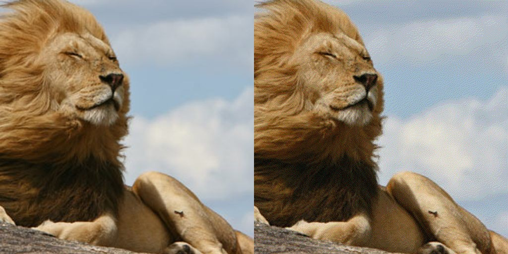

<h1> Dither.io </h1>

<!--Contents --> 

  
Some basic things about this code

  <ul>
    <li>
      <a href="#stippling">What is Stippling?</a> 
    </li>
    <li>
      <a href="#quantize">What is Quantizing in an Image?</a>
    </li>
    <li>
       <a href="#dither">What is Dithering in an Image?</a>
    </li>
    <li>
       <a href="#usage">What is the use of this code?</a>
    </li>
    <li>
       <a href="#platforms">Platform and Language Used</a>
        <ul>
          <li><a href="https://processing.org/download">Processing Platform</a></li>
          <li>Language Used: Java</li>
        </ul>
    </li>
    <li>
       <a href="#input">Input Image</a>
    </li>
    <li>
       <a href="#output">Comparison Image</a>
    </li>
  </ul> 

 
 
<!--Strippling -->
## <a name="stippling" />What is Stippling?
Stippling is a process where any chosen image can be represented as dots instead of pixels.
The dots can also be color coded as per user's desire. It creates a pattern using various
degrees of shading by small dots of any color.

<!--quantize-->
## <a name="quantize" />What is Quantizing an Image?
It is a compression technique where an image can be reduced in its size by 
meddling with the color codes of each pixel. In precise, the values 
range of each color R, G and B is reduced and these colors are 
induced in to the picture. It results in an image with lesser range of 
colors than the original picture.  

<!--Dithering -->
## <a name="dither" />What is Dithering?
It is a process of defining the gradations of gray or color shades by 
changing the gray or color codes of its neighboring pixels.

<!--Use-->
## <a name="usage" />What is the use of this code?
This code takes an image as input, renders its pixels and its color 
codes, then places the updated pixels and color codes into the 
picture to get a stippled form of the original image.

<!-- Input Image -->
## <a name = "input">Input Image
  
  

<!-- Output Image --> 
## <a name = "output">Input and Output Comparison
 

